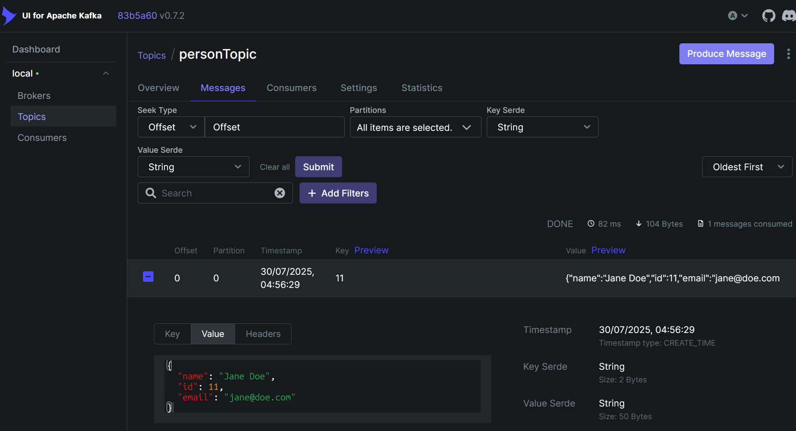

# CLI Proto Sender

Simple Command Line Interface for sending JSON to Kafka.

## Features

- Created a `personTopic`
- Supports `.json` files for sending message
- Will work with default values for testing if parameter is not send
- Dependencies on SpringBoot, Apache Kafka
- Uses Docker for set up


## How to run

### Docker

1. Build image

```
docker-compose -f ops/docker-compose.yaml build app
```

2. Start Kafka

```
docker-compose -f ops/docker-compose.yaml up -d zookeeper kafka kafka-ui kafka-init
```

3. Send message

```
# Using local example internally
docker-compose -f ops/docker-compose.yaml run --rm app send-message

# Sending local example as parameter
docker-compose -f ops/docker-compose.yaml run --rm app send-message --file=src/main/resources/person-example.json
```

### Access the UI

Kafka enables us to access its UI and check the topic. It's hosted locally after running docker:

```
http://localhost:8090
```

